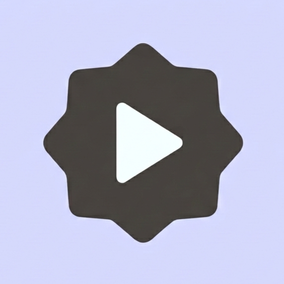
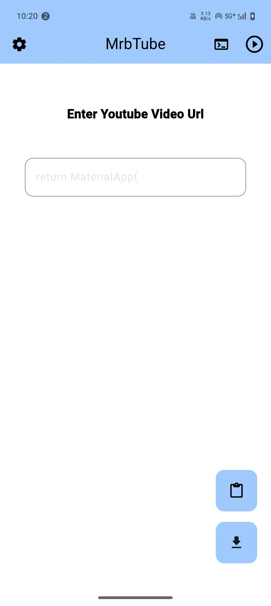
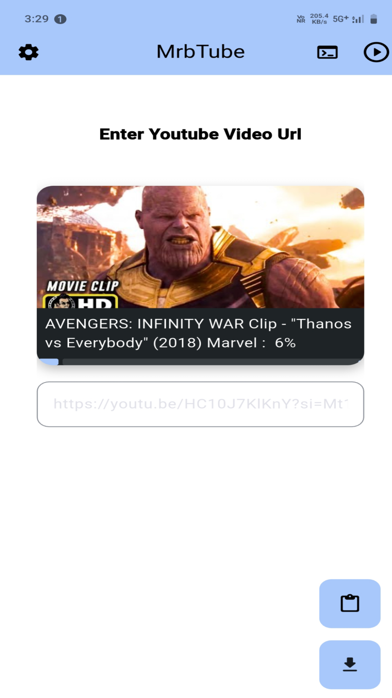
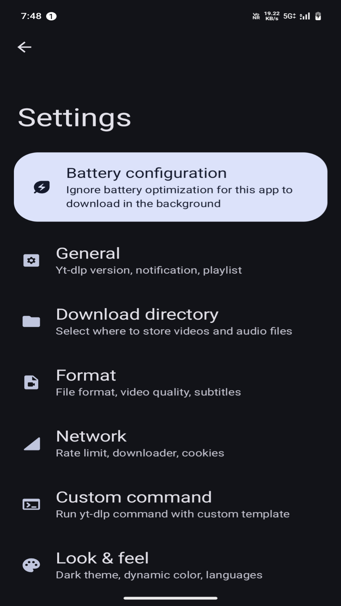

<div align="center">
  
  
  <h1>MrbTube</h1>

  <p><i>A modern, lightning-fast, and open-source video client built with Flutter.</i></p>

  <p>
    
    
    
    
    
  </p>

  <br/>

  <p>
    <a href="#-features">Features</a> •
    <a href="#-screenshots">Screenshots</a> •
    <a href="#%EF%B8%8F-build-from-source">Build</a> •
    <a href="#-contributing">Contributing</a> •
    <a href="#-license">License</a>
  </p>
</div>

---

<br/>

## 📱 Screenshots

<div align="center">
  
  &nbsp;&nbsp;
  
  &nbsp;&nbsp;
  
</div>

<br/>

---

## ✦ Features

- **Blazing Fast** — Built on Flutter, runs at native 60fps on every device, no compromises.
- **Zero Ads, Zero Tracking** — No analytics, no fingerprinting, no background calls. Period.
- **Minimal UI** — Clean, distraction-free design. Just you and your content.
- **Cross-Platform** — Android, iOS — one codebase, one experience.
- **Material You** — Follows Material Design 3 with dynamic theming support.
- **100% Open Source** — GPLv3 licensed. Fork it, break it, improve it.

---

## 🛠️ Build from Source

### Requirements

- Flutter SDK `>=3.0.0` — [Install Flutter](https://docs.flutter.dev/get-started/install)
- Dart `>=3.0.0`
- Android Studio or VS Code

### Setup

```bash
# Clone the repo
git clone https://github.com/Mrb-Official/MrbTube.git
cd MrbTube

# Get dependencies
flutter pub get

# Run on device/emulator
flutter run
```

> Run `flutter doctor` first to verify your setup is clean.

### Build Release APK

```bash
flutter build apk --release
# Output: build/app/outputs/flutter-apk/app-release.apk
```

---

## 📂 Project Structure

```
lib/
├── main.dart           # Entry point
├── screens/            # UI screens
├── widgets/            # Shared components
├── models/             # Data models
└── services/           # API & video services

assets/
├── logo.png
└── screenshots/
```

---

## 🤝 Contributing

Pull requests are welcome. For major changes, open an issue first to discuss what you'd like to change.

```bash
# 1. Fork the repo
# 2. Create your branch
git checkout -b feature/your-feature

# 3. Commit and push
git commit -m "feat: add your feature"
git push origin feature/your-feature

# 4. Open a Pull Request
```

Please follow the existing code style and keep commits clean.

---

## 🐛 Reporting Bugs

Open an [issue](https://github.com/Mrb-Official/MrbTube/issues) and include:

- Device & OS version
- Steps to reproduce
- Expected vs actual behavior
- Logs (if possible)

---

## 📜 License

```
MrbTube — Open Source Video Client
Copyright (C) 2024 Mrb-Official

This program is free software: you can redistribute it and/or modify
it under the terms of the GNU General Public License as published by
the Free Software Foundation, either version 3 of the License.
```

Full license → [`LICENSE`](./LICENSE)

---

<div align="center">
  <br/>
  <p>
    
    &nbsp;
    
  </p>
  <p><sub>If this project helped you, consider giving it a ⭐</sub></p>
</div>
